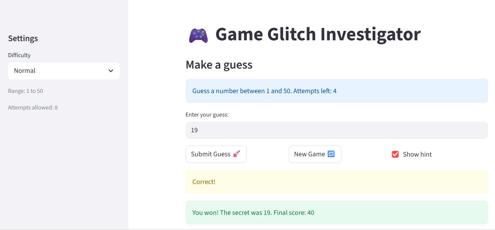

# Game Glitch Investigator: The Impossible Guesser

This project is a repaired Streamlit number guessing game. The original AI-generated version had multiple gameplay and state bugs that made it confusing or impossible to play consistently. The goal of the app is simple: choose a difficulty, guess the secret number, and win before you run out of attempts.

## Project Purpose

The game lets the player:

- choose `Easy`, `Normal`, or `Hard`
- guess a secret number within the displayed range
- receive `Higher` or `Lower` hints
- track attempts, score, and guess history
- restart with a clean game state

This lab focused on debugging AI-generated code, fixing Streamlit state issues, and moving reusable logic into testable helper functions.

## Bugs Found

When I tested the original app, I found several concrete problems:

- the secret number could reset during reruns, which made the game feel unfair
- the `Higher` and `Lower` hints were reversed in some cases
- a string/integer mismatch caused incorrect comparisons and misleading hints
- the selected difficulty did not always match the secret-number range
- changing difficulty did not fully reset the game state
- restarting the game did not properly restore attempts and other session values

## Fixes Applied

I fixed the app by making the following changes:

- stored the secret number and other game values in `st.session_state` so they persist across Streamlit reruns
- corrected the guess-checking logic so hints now match the real comparison
- normalized values in the comparison logic to avoid string-based comparison bugs
- moved reusable game logic into `logic_utils.py`
- matched each difficulty to the correct numeric range
- reset attempts, history, score, status, and secret number when starting a new game
- kept the app behavior aligned with automated tests in `tests/test_game_logic.py`

## Files

- `app.py` contains the Streamlit interface and session-state flow
- `logic_utils.py` contains parsing, comparison, range, and scoring logic
- `tests/test_game_logic.py` contains regression tests for core game behavior
- `reflection.md` documents my debugging process and what I learned

## How to Run

1. Install dependencies:

```bash
pip install -r requirements.txt
```

2. Start the app:

```bash
python -m streamlit run app.py
```

3. Run the tests:

```bash
pytest
```

## Test Result

The current test suite passes:

- `4/4 passed`

## Demo


